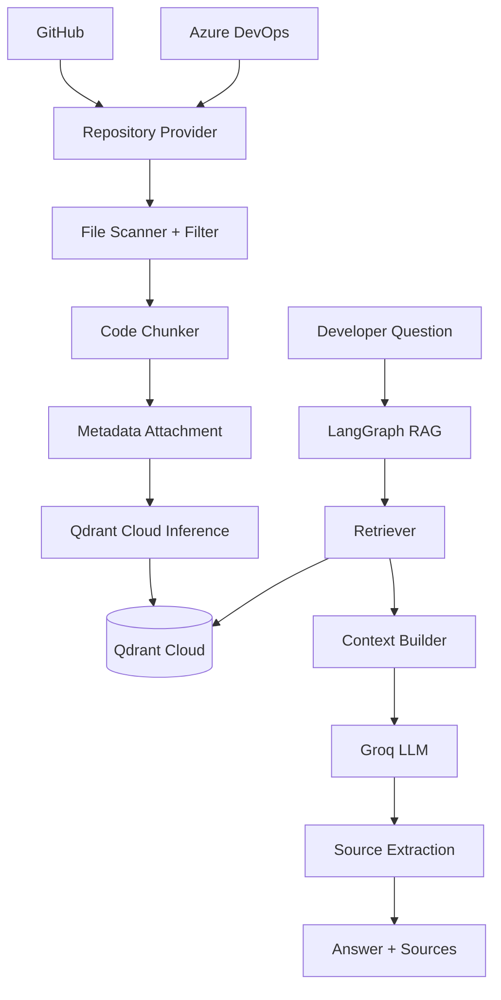

# Git Repository Code Assistant

A RAG-based code assistant that indexes GitHub and Azure DevOps repositories
and answers natural-language questions about the codebase, grounded in the
actual retrieved source code rather than model guesswork.

Ask things like:

- Where is authentication implemented?
- Explain the login flow.
- Which functions call `create_access_token`?
- Where is the database connection configured?

The assistant answers only from retrieved repository context. When the
index doesn't contain enough evidence, it says so instead of guessing.

## Architecture



Repository providers (GitHub, Azure DevOps) only produce a local checked-out
directory. Everything downstream, scanning, filtering, chunking, embedding,
storage, retrieval, and generation, is provider-agnostic.

### Local vs. cloud

| Runs locally | Runs on a hosted service |
|---|---|
| Git clone | Qdrant Cloud Inference (embeddings) |
| File scanning and filtering | Qdrant Cloud (vector storage and search) |
| Code chunking | Groq (answer generation) |
| Metadata extraction | |

### LangGraph workflow

```text
START -> validate_query -> rewrite_query -> retrieve_code -> check_retrieval
                                                                |        |
                                                       sufficient   insufficient
                                                                v        v
                                                        build_context  fallback_response
                                                                v            |
                                                        generate_answer      |
                                                                v            |
                                                        extract_sources      |
                                                                v            v
                                                               END          END
```

Each node has one job. `check_retrieval` routes to a fixed
"not enough evidence" response instead of letting the LLM improvise when
nothing relevant was retrieved. `extract_sources` builds the source list
from retrieved metadata; the LLM never authors citations.

## Deviations from the original spec

The build spec had two internal contradictions, resolved as follows (see
`CLAUDE.md` in this repository for the full reasoning):

1. **Embeddings run on Qdrant Cloud Inference, not a local HuggingFace
   model.** One section of the spec described a local
   `BAAI/bge-small-en-v1.5` HuggingFace embedding service; another section
   explicitly required Qdrant Cloud Inference and forbade running a local
   embedding model in V1. The Qdrant Cloud Inference requirement matches
   the spec's title, its acceptance criteria, and the majority of the
   document, so that's what's implemented. No `sentence-transformers` or
   `transformers` dependency exists in this codebase.
2. **The vector store is Qdrant Cloud only.** One line in the spec's
   deliverables list mentioned "Chroma"; every other section (title,
   architecture, the dedicated vector-store section, acceptance criteria)
   specifies Qdrant Cloud. Treated as a leftover typo, not a requirement.
3. **`QDRANT_EMBEDDING_DIMENSION` is a required setting alongside
   `QDRANT_EMBEDDING_MODEL`.** Qdrant Cloud Inference does not expose a
   model's output vector size through the client API; it's only visible in
   the Inference tab of your cluster in the Qdrant Cloud console. The
   collection has to be created with the correct vector size up front, so
   this is configuration the operator provides rather than something the
   app can infer.
4. **The vector store talks to `qdrant-client` directly, not
   `langchain-qdrant`.** As of this build, `langchain-qdrant`'s
   `QdrantVectorStore` does not support Qdrant Cloud's server-side
   inference (it expects a local `Embeddings` object that returns
   pre-computed vectors). `QdrantVectorStoreService`
   (`app/vectorstore/qdrant_store.py`) wraps the raw client instead, which
   satisfies the spec's own requirement to keep Qdrant-specific code behind
   one service so the retrieval and LangGraph layers stay decoupled from it.

## Prerequisites

- Python 3.12+
- [uv](https://docs.astral.sh/uv/) for dependency management
- [bun](https://bun.sh/) for the frontend (`frontend/`)
- A Qdrant Cloud cluster (free tier works) with Cloud Inference enabled
- A Groq API key
- A GitHub personal access token (only needed for private repositories)
- An Azure DevOps personal access token (only needed for private
  repositories, Code Read scope is sufficient)

## Environment variables

Copy `.env.example` to `.env` and fill in real values:

| Variable | Required | Purpose |
|---|---|---|
| `GROQ_API_KEY` | Yes | Groq authentication |
| `GROQ_MODEL` | Yes | Groq chat model id. Availability changes over time and per account: check `GET https://api.groq.com/openai/v1/models` with your key rather than trusting a hardcoded example. |
| `GITHUB_TOKEN` | No | Default GitHub PAT, used when a request doesn't supply its own `access_token` (see below) |
| `AZURE_DEVOPS_PAT` | No | Default Azure DevOps PAT (Code Read scope), same fallback role |
| `QDRANT_URL` | Yes | Qdrant Cloud cluster URL |
| `QDRANT_API_KEY` | Yes | Qdrant Cloud API key |
| `QDRANT_COLLECTION_NAME` | No (default `code_chunks`) | Shared collection; isolation is enforced by payload filters |
| `QDRANT_EMBEDDING_MODEL` | Yes | A model exposed by your cluster's Inference tab, for example `sentence-transformers/all-minilm-l6-v2` |
| `QDRANT_EMBEDDING_DIMENSION` | Yes | Vector size for the model above, read from the same Inference tab |
| `CORS_ALLOWED_ORIGINS` | No (default `http://localhost:5173`) | Comma-separated origins the frontend is served from |
| `REPOSITORY_STORAGE_DIRECTORY` | No | Where repositories are cloned locally |
| `REPOSITORY_METADATA_DB_PATH` | No | SQLite file for repository metadata |
| `CHUNK_SIZE` / `CHUNK_OVERLAP` | No | Chunking parameters |
| `RETRIEVAL_TOP_K` | No (default 8) | Chunks retrieved per query |
| `MAX_INDEX_FILE_SIZE_KB` | No (default 512) | Files larger than this are skipped |

Never commit `.env`. Tokens are never logged, never returned in API
responses, and never stored in repository metadata.

## Private repository credentials

`GITHUB_TOKEN` / `AZURE_DEVOPS_PAT` in `.env` are a single, server-wide
default identity, not a per-user account system (this app has no login).
That's fine for one operator indexing their own repos, but it breaks down
the moment different people need access to different private repos: they'd
all be sharing one identity's access.

For that case, `POST /repositories/index` (and the frontend's "Add
repository" form) accepts an optional `access_token` per request:

```json
{
  "provider": "github",
  "repository_url": "https://github.com/org/private-repo",
  "branch": "main",
  "access_token": "ghp_..."
}
```

It's used once for that single clone, then discarded: never persisted to
SQLite, never logged, never returned in any response, and never embedded in
the clone URL (which git would otherwise write into the cloned repo's local
`.git/config` in plaintext). The frontend remembers what you type in
`sessionStorage`, scoped to that browser tab, cleared when the tab closes,
never sent anywhere except that index request.

If `access_token` is omitted, the request falls back to the server's
`GITHUB_TOKEN` / `AZURE_DEVOPS_PAT` default.

**This means a token now travels over the network with each index
request.** Put this behind HTTPS before exposing it beyond local
development; sending a PAT over plain HTTP is not meaningfully different
from putting it in a URL query string.

## Installation

```bash
uv sync
cp .env.example .env
# edit .env with real credentials
```

## Running

```bash
uv run uvicorn app.main:app --reload
```

Or:

```bash
uv run python run.py
```

Interactive API docs: `http://localhost:8000/docs`.

## Indexing a GitHub repository

```bash
curl -X POST http://localhost:8000/api/v1/repositories/index \
  -H "Content-Type: application/json" \
  -d '{
    "provider": "github",
    "repository_url": "https://github.com/example/backend",
    "branch": "main"
  }'
```

Add `"access_token": "ghp_..."` to the body for a private repository
(falls back to `GITHUB_TOKEN` if omitted).

Response:

```json
{
  "repository_id": "github-example-backend",
  "status": "indexed",
  "files_scanned": 321,
  "files_indexed": 176,
  "chunks_created": 938,
  "branch": "main"
}
```

## Indexing an Azure DevOps repository

```bash
curl -X POST http://localhost:8000/api/v1/repositories/index \
  -H "Content-Type: application/json" \
  -d '{
    "provider": "azure_devops",
    "repository_url": "https://dev.azure.com/company/project/_git/backend",
    "branch": "main"
  }'
```

Add `"access_token": "..."` to the body, or set `AZURE_DEVOPS_PAT` in
`.env`, if the repository is private.

## Querying a repository

```bash
curl -X POST http://localhost:8000/api/v1/chat/query \
  -H "Content-Type: application/json" \
  -d '{
    "repository_id": "github-example-backend",
    "branch": "main",
    "question": "Where is JWT authentication implemented?"
  }'
```

Response:

```json
{
  "answer": "Authentication is handled by authenticate_user in app/auth/service.py, which verifies credentials and issues a signed access token via create_access_token in app/auth/jwt.py.",
  "sources": [
    { "file_path": "app/auth/service.py", "start_line": 20, "end_line": 71 },
    { "file_path": "app/auth/jwt.py", "start_line": 8, "end_line": 35 }
  ],
  "repository_id": "github-example-backend"
}
```

## Other endpoints

```bash
# List all indexed repositories
curl http://localhost:8000/api/v1/repositories

# Repository status
curl http://localhost:8000/api/v1/repositories/github-example-backend

# Delete a repository's index (vectors, local clone, and metadata)
curl -X DELETE http://localhost:8000/api/v1/repositories/github-example-backend

# Health check
curl http://localhost:8000/health
```

## Frontend

A React + TypeScript + Vite dashboard lives in `frontend/`: paste a
repository link to index it, browse indexed repositories, and ask questions
with grounded answers and file/line source citations, all against the API
above. The "Add repository" form includes an optional personal access
token field for private repos (see "Private repository credentials"
above), remembered per-provider in that browser tab's `sessionStorage`
only. No frontend-side auth/login exists (the backend has none either); if
you expose this beyond local development, put an auth layer in front of
both.

```bash
cd frontend
bun install
cp .env.example .env.local   # set VITE_API_BASE_URL if the backend isn't on localhost:8000
bun dev                      # http://localhost:5173
```

The backend's `CORS_ALLOWED_ORIGINS` defaults to `http://localhost:5173`,
matching Vite's default port. Run `bun run build` for a static production
bundle (`frontend/dist/`), deployable behind any static file server.

## Supported source files

Code: `.py .js .jsx .ts .tsx .java .cs .go .rs .cpp .cc .c .h .hpp .sql`

Docs and config: `.md .txt .yml .yaml .json .toml`, plus `Dockerfile`,
`docker-compose.yml`, `requirements.txt`, `pyproject.toml`, `package.json`.

Generated/dependency directories (`.git`, `node_modules`, `.venv`, `dist`,
`build`, and similar) and binary/compiled files are always skipped. See
`app/core/config.py` for the full, centralized list.

## Running tests

```bash
uv run pytest
```

The automated suite never calls Groq or Qdrant Cloud over the network: LLM
calls are replaced with a fake `invoke()`, and the vector store is replaced
with an in-memory fake that applies the same repository/branch filtering
Qdrant would.

## Known limitations

- Symbol detection (`symbol_name` / `symbol_type`) is regex-based, not
  AST or Tree-sitter based. It works well for common patterns and is
  intentionally best-effort, per the spec's V1 scope.
- Re-indexing is full replacement, not incremental commit-diff indexing.
- No hybrid (BM25) search or reranking.
- No conversation memory: each question is answered independently.
- No authentication on the API or the frontend; deploy behind your own
  auth layer if exposing this beyond local development.
- Indexing runs synchronously within the request; large repositories will
  make `POST /repositories/index` take a while to respond.

## Future improvements

Tree-sitter/AST-based chunking, symbol and call-graph search, hybrid
BM25 + vector search, reranking, incremental commit-based re-indexing,
conversation memory, background job processing for indexing, webhooks for
automatic re-indexing on push, multi-repository search, an automated
frontend test suite (Vitest/Testing Library), and auth for both the API
and the frontend if deployed beyond local development.
